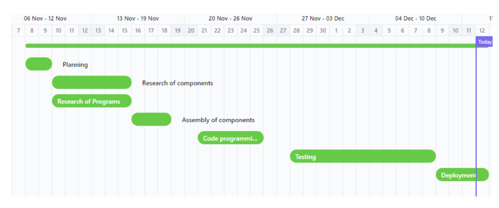
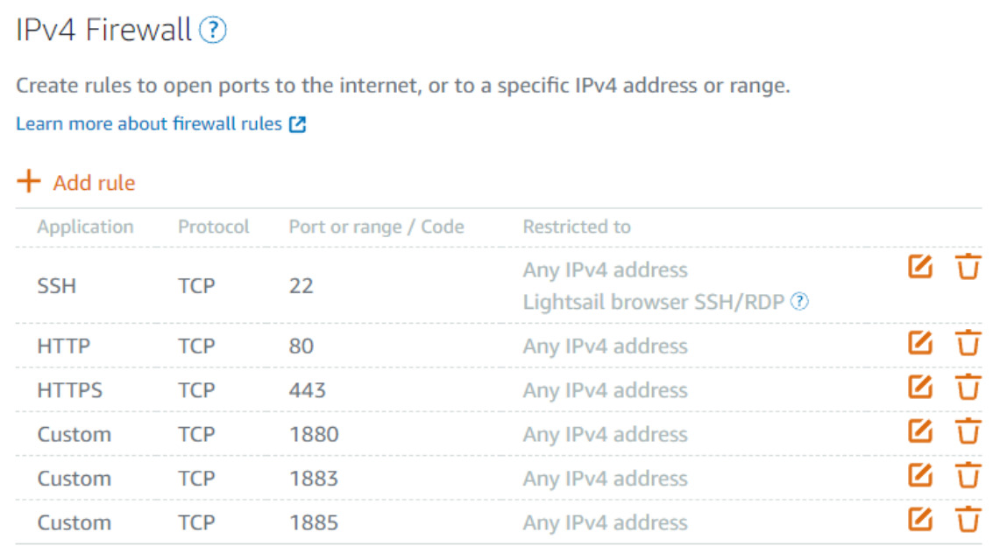
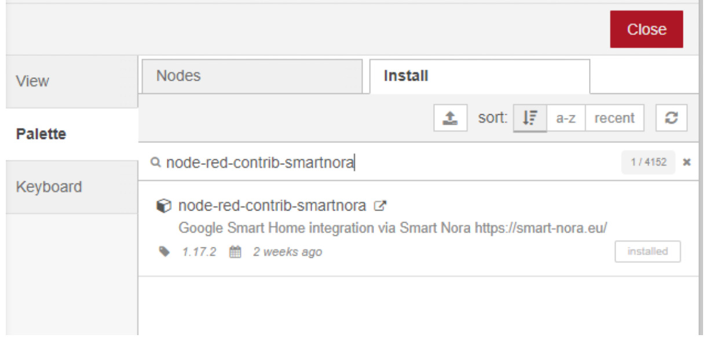
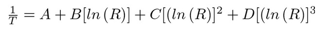
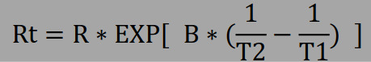
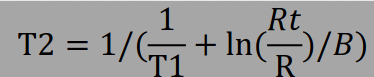

# micro-1-group-project-los-esquimales

Teammates:
- Angel L Garcia
- Alex J Strubbe
- Samuel (brilla por su ausencia)

## Intro

A wack project done in the esp32, Node-RED, and god knows what else for the course of Microprocessors I - Fall 2022

The general idea is that a user in their smartphone call out siri, cortana, google, bitsby, or any other service and say "is the air on?". The service then replies by asking: "At what classroom number? ", and you say which Stefani building classroom is and the service answers if the a/c is on or off along with how cold or warm it is and if its on it also gives the current temperature of the room.

This seemingly simple project uses Amazon's AWS services and a ESP32 that takes the temperature readings (hence why this is an IoT project).

The team "Los Esquimales" consists of Angel, Alex and Samuel (Goodman) are all computer engineering students that unanimously decided to choose this project and not the trolley one because we want to keep our sanity in check (nothing personal).

Project repo can be found [here](https://github.com/FrenzyExists/micro-1-group-project-los-esquimales)

To organize ourselves we used clickup originally, but because the app simply didn't suit our needs we switched to Trello. Trello link.


# High Level Architecture

As said, this is an IoT project, so lets start with the high-level stuff. The way this works is that we use an ESP32 microcontroller by esspressif connected to a generic 2-pin termistor. We wanted to also use a DHT22, but our professor said no. Since he's the manager, the manager's word is the law. Another constrain our professor gave was to not use the function `analogRead` and instead use the more low-level functions that analogRead utilized. In simple words, implement our own version of `analogRead`. Refer to the *Hardware Architecture* section to further know the details on how we are working around this constrain.

We place the device in an ESP32 over a classroom and using a keypad we asign the room number. Then we connect the ESP32 to the campus internet. This is so we can connect with a remote cloud computer that has an MQTT Broker protocol. More of that on *Cloud Architecture*, but for simplicity, we use it to retrieve data and send data in form of a RESTful API so our phones and computers can access said data in some voice command service like Siri or Bitsbi.

## Tools

We used a couple of tools to get this done, for coding we're `VSCode` with the `PlatformIO` extension for embedded system development and the `C/C++` for syntax highlighting. For the implementation of the MQTT Broker we're using NodeRed as its easier to develop there due to its low-code nature. For testing we're using different college classrooms as well as our houses/apartments that could have an A/C around. To organize ourselves we're using Google Meets for quick reunions and Trello to see our tasks in both kanban boards and deadlines gantt charts to track of everything like the one shown bellow:




## Cloud Architecture

So, what's cloud architecture? According to VMware, "is the way technology components combine to build a cloud, in which resources are pooled through virtualization technology and shared across a network". The cloud machine was made with the help form amazon AWS services, here we installed all the necessary media to make the project possible such as: MQTT, Node js, Node-red, and others. MQTT is used for lightweight communication  via a publish and subscribe service for messaging with remote devices which require a small code footprint and minimal network bandwidth. This lets us communicate with the ESP-32s much easier and faster than most other services. Up next we can see a visualization on how the communication works between the MQTT client publisher, the MQTT Broker and the MQTT client subscribers.


### Setting up node-red

First we need to create an AWS or other cloud service that allows us to create a machine on the cloud. Once we have chosen our place of preference we can proceed with the node red installation. Then we can create a SSH connection with a key, search for a tutorial on how to ssh to a device.

Once this is done, update the server using the following command:

```
sudo apt-get update
sudo apt-get upgreade
```

Having this done we can proceed to execute the following commands to install nodejs, npm and node-red:

```sh
sudo apt-get install nodejs
node -v // checks nodejs version
sudo apt-get install npm
npm -v // also checks npm version
sudo npm install -g unsafe-perm node-red node-red-admin
sudo ufw allow 1880
```

And setting up the node red so it doesn't hang up:

```
nohub node-red &
```

having this done, we can access the server and habilitate the following ports if not enabled already:



To access the domain to your node red we input on the browser `<MACHINE_IP>:1880` and here we can begin to develop our node red application.  

To access the google assistant services via node red we need to download the following on our node red app:



This will let us set up a sensor device which will let us add it to our google home.

To achive that just follow the documentation for [smart nora](https://github.com/andrei-tatar/node-red-contrib-smartnora/blob/master/doc/setup/README.md)

After all that feel free to start working on your automation.

## Hardware Architecture

One of the challenging parts aside setting up google home to communicate with node-red is to calibrate the termistor. This is due to a lack of information from the manufacturer. To make the story short, you can calibrate a termistor using a table provided by said manufacturer. If this is plotted it can be visualized like this:


Although one can utilize linear interpolation, it is easier to use the specified constants from the manufacture and apply

Steinhart-Hart Equation:



However, because no coefficients where found, we instead used the following formula for the calibration, which uses a Beta that we were able to obtain from the manufacturer:



This allow us to calculate the resistance by taking in count the fact that the termistor and potenciometer is arranged as a voltage divider. For the temperature we did used the following formula:



Where the T1 temperature is our reference temperature which can be set from the node-red system.